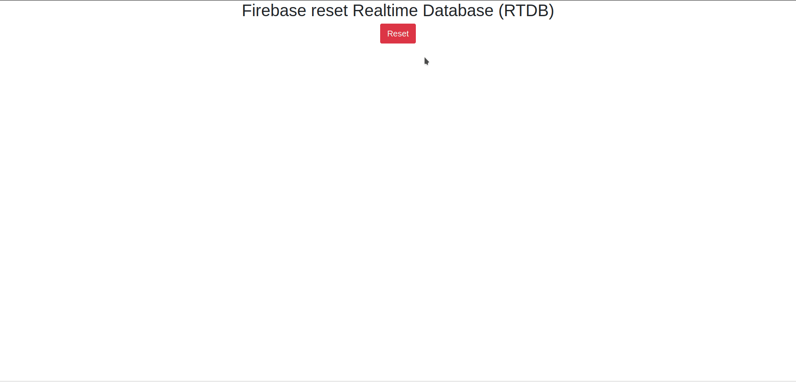

# **Alternative-to-firebase - Demo with Firebase**

This folder contains the reference example with Firebase.

The Firebase service allows instantaneous updating of data on the client/browser, without the need to configure a server (websocket) as required for the [example with PostgreSQL](../PostgreSQL_example/README.md).

## **How to launch the project**

### **Requirements**

Before you can launch the node server, you must first create and modify a file ([resetFirebaseRTDB/firebaseConfig.js](resetFirebaseRTDB/firebaseConfig.js)).

If you don't know how to get the values, you can consult this [page](https://firebase.google.com/docs/web/setup?hl=en#config-object).

For the file, you just have to create it and fill it with the necessary information to connect to Firebase as for the example below.

```js
var firebaseConfig = {
    apiKey: "***",
    authDomain: "***",
    databaseURL: "***",
    projectId: "***",
    storageBucket: "***",
    messagingSenderId: "***",
    appId: "***"
};
```

To initialize the data, please see these [instructions](#reset-the-firebase-rtdb).

### **Launch the project**

Unlike the other [example with PostgreSQL](../PostgreSQL_example/README.md), this demo does not need an https server, and to launch the project, you only need to open this [page](index.html) in your browser. Nevertheless, if needed, it is possible to use the same principle as in the other demo, with few changes. It is also possible to use any other https server you have (Apache, NGINX, ...), but this will not be detailed here.

## **Firebase Realtime Database**

### **Rules**

This project is only a demo to prove that it is possible to have the "real time" side of Firebase, but without Firebase. So the security rules have not been written, and it is enough to use lax rules allowing reading and writing in all the nodes in order for this project to work

```json
{
  "rules": {
    ".read": "now < 1630965600000",  // 2021-9-7
    ".write": "now < 1630965600000",  // 2021-9-7
  }
}
```

> Note: *These rules allow writing to and reading from all Firebase nodes up to a certain date. If necessary change this date or replace the conditions with "true".*

### **Reset the Firebase RTDB**

It is possible to reset Firebase nodes by going to this [page](resetFirebaseRTDB/resetFirebaseRTDB.html) on a browser and clicking on the button.



## **Web page: [main.js](main.js)**

Most of this file is similar to the one for the PostgreSQL demo, except of course the part with Firebase which is replaced by websocket communications with the server on the other demo.

There is no error handling when reading or writing to Firebase on this demo, it should be added for a real use (as well as Firebase rules). Nevertheless they have been realized in the other demo.

> Note: *This file should be re-factored to improve readability.*