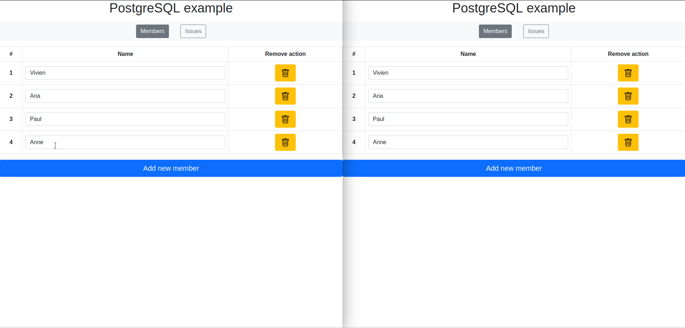
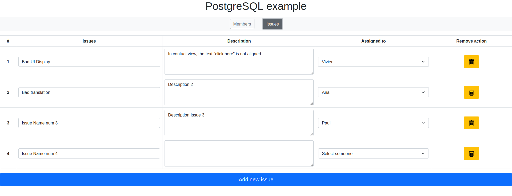
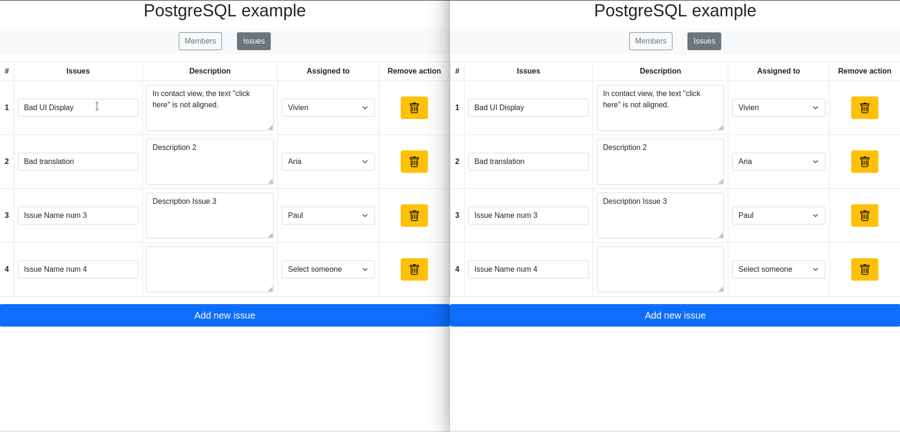
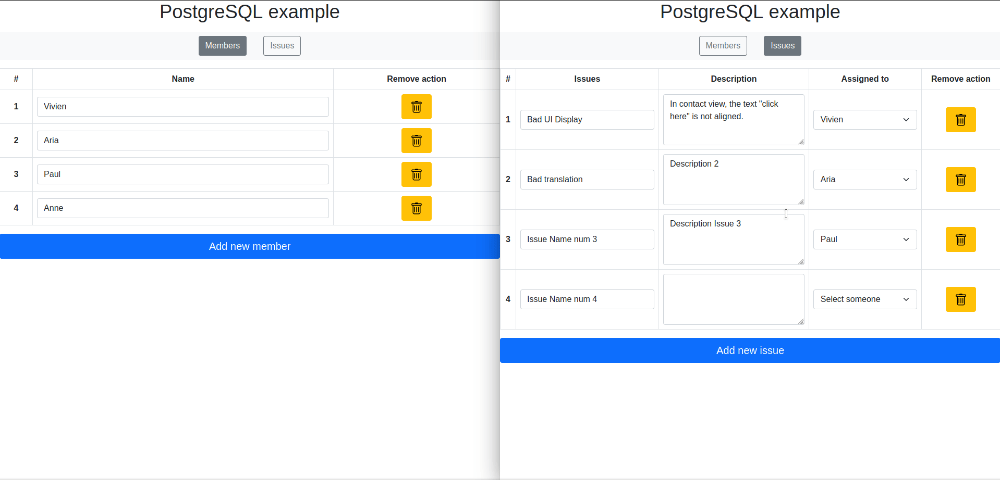

# **Alternative-to-firebase**

This is a small demo to test if we can have a real time database like Firebase, but with a PostgreSQL database with WebSocket for the real time side.

The project has 2 parts (**PostgreSQL_example** and **Firebase_example**), each one including the same project, but realized according to the mentioned tool.

- [Link to the demo with Firebase](Firebase_example/README.md)
- [Link to the demo with PostgreSQL](PostgreSQL_example/README.md)

## **The project of the demo**

The project is presented as a task management tool, with 2 views: 
- [The members' view](#the-members-view)
- [The issues' view](#the-issues-view)

> Note 1: *The context of the project does not necessarily have a specific goal, because the goal of the project was to have 2 similar projects from the point of view of instantaneity, one with Firebase, and the other with PostgreSQL.*

> Note 2: *As for the point above, the design was just made to be functional, without being really pretty.*

> Note 3: *The screenshots and gifs below were taken in the PostgreSQL sample project, but the rendering is the same on the Firebase sample project.*

### **The members' view**

This view lists all members with their *names*.

It is possible to **modify the name** of each member, to **add as well as to delete any member**. Each of these actions is **immediately synchronized** on all open browsers on the same page.

> Note: *As this is a demo, all members are loaded, but this would not be suitable for an application used with a lot of data.*

### **The issues' view**

This view lists all issues with their *names*, their *descriptions* and *the member to which this task has been assigned* (if it exists).

It is possible to **modify the name, the the description and the member to which this issue is assigned**, to **add as well as to delete any issue**. Each of these actions is **immediately synchronized** on all open browsers on the same page.

> Note: *As this is a demo, all issues are loaded, but this would not be appropriate for an application used with a lot of data.*

### **The interactions between the 2 views**

The only interaction between these two views is the modification (change of name, addition or deletion) of a member which modifies the associated list in the choice of the member who has the assignment of an issue.

It is possible to delete all issues unconditionally, but for members it is necessary that they have not been associated with any issue, otherwise deletion will be impossible.

> Note: *At the time of writing, this feature is only available with the PostgreSQL demo. To have this feature on the Firebase demo, you need to make the associated [Firebase RTDB rules](https://firebase.google.com/docs/database/security), and handle the error that it will return to the client/browser.*

