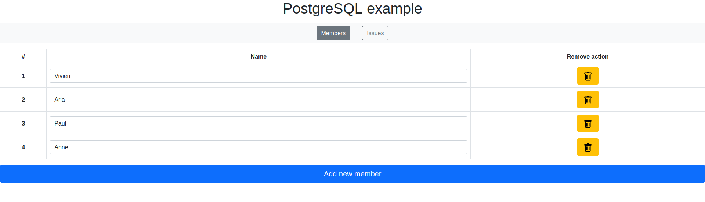

# Alternative-to-firebase

This is a small demo to test if we can have a real time database like Firebase, but with a PostgreSQL database with WebSocket for the real time side.

The project has 2 parts (**PostgreSQL_example** and **Firebase_example**), each one including the same project, but realized according to the mentioned tool.

- [Link to the demo with Firebase](Firebase_example/README.md)
- [Link to the demo with PostgreSQL](PostgreSQL_example/README.md)

## The project of the demo

The project is presented as a task management tool, with 2 views: 
- [The members' view](#the-members-view)
- [The issues' view](#the-issues-view)

> Note: The context of the project does not necessarily have a specific goal, because the goal of the project was to have 2 similar projects from the point of view of instantaneity, one with Firebase, and the other with PostgreSQL.

> Note: As for the point above, the design was just made to be functional, without being really pretty.

### The members' view

This view lists all members with their *names*.

### The issues' view

This view lists all issues with their *names*, their *descriptions* and *the member to which this task has been assigned* (if it exists).

